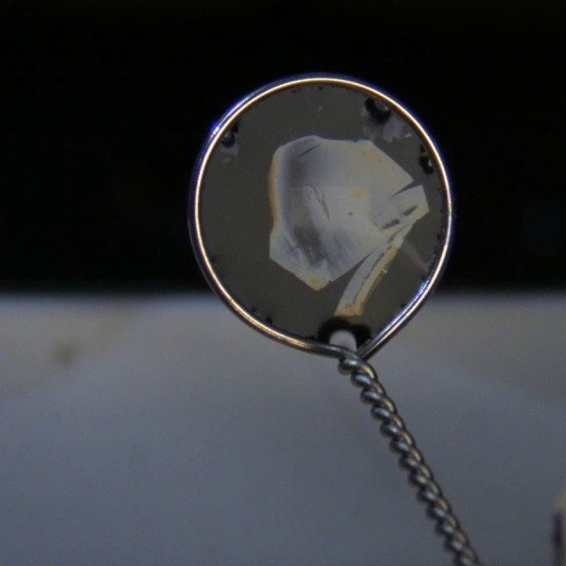
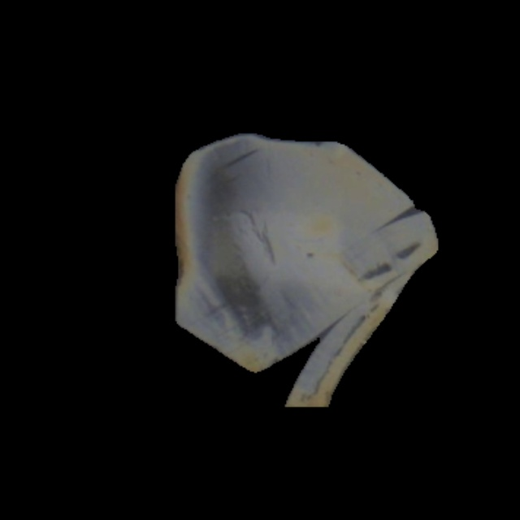

# AutoTomeQC
Sectioning Quality Control
[](LICENSE)

### Example Pipeline
| Input Image | Segmentation | QC Runs|
| :---: | :---: | :---: |
|  |  | <pre>Ready &gt; example/input_images/img1.jpg<br>Processing: img1<br>Status:     FAIL<br>Reason:     Section failed QC criteria<br> -&gt; Section 0: FAIL \| Area: 24504px<br>    ✅ coverage: full_section<br>    ❌ knife_mark: knifemark_shredding<br>    ✅ thickness_consistency: Consistent<br>    ✅ thickness: 60<br>    ✅ shape: Diamond</pre> |

##  Getting Started
- [Install uv](https://docs.astral.sh/uv/getting-started/installation/)
```bash
uv sync
uv run autotomeqc
```

## Usage 1. Interactive Mode (CLI)

Use this mode to quickly test your saved section images. It launches the service and waits for you to paste file paths for analysis.

Run the service:
```bash
uv run autotomeqc
```

Once the service says `Ready >`, you can:

Paste a file path: `example/input_images/img0.jpg`

Exit: Type `exit`, `stop`, or press `Ctrl+C`.


## Usage 2. Python Library 

You can import `AutoTomeService` directly into your own Python code to integrate QC into your acquisition loops.

See the example codes  `example/example_import.py`

```bash
from autotomeqc.core.autotome_service import AutoTomeService

# Initialize Service (Loads YOLO & Classification Models)
service = AutoTomeService()
service.start()

# Method A: Process by File Path
future_a = service.process(img_path="data/img1.jpg")
result = future_a.result()  # Wait for the result
print(f"QC Status: {result['qc_summary']}")

# Method B: Process by Raw Frame (e.g., from Camera)
future_b = service.process(frame=frame)
result = future_b.result()  # Wait for the result
print(f"QC Status: {result['qc_summary']}")

service.stop()
```

## Output
You can view the results directly in the terminal:

**Example Output:**
```bash
Ready > example/input_images/img1.jpg
Processing: img1
Status:     FAIL
Reason:     Section failed QC criteria
 -> Section 0: FAIL | Area: 24504px
    ✅ coverage: full_section
    ❌ knife_mark: knifemark_shredding
    ✅ thickness_consistency: Consistent
    ✅ thickness: 60
    ✅ shape: Diamond
```

And, a full JSON report is also saved to disk.

- **Directory:** The location is defined in `src/autotomeqc/config/yolo-config.yaml` (see the `output_dir` setting).
- **Files:** `{filename}_qc.json`

**Example JSON Report:**
```json
{
    "filename": "img1",
    "timestamp": "2026-04-23 20:49:57",
    "qc_summary": "FAIL",
    "fail_reason": "Section failed QC criteria",
    "processing_time_sec": 0.5774,
    "sections": [
        {
            "qc_result": "FAIL",
            "segmentation_conf": 0.96,
            "area_in_pixels": 24504,
            "overlap_ratio": 1.0,
            "criteria": {
                "coverage": {
                    "pass_status": true,
                    "label": "full_section",
                    "conf": 0.9958
                },
                "knife_mark": {
                    "pass_status": false,
                    "label": "knifemark_shredding",
                    "conf": 0.9992,
                    "reason": "Defect Detected: knifemark_shredding"
                },
                "thickness_consistency": {
                    "pass_status": true,
                    "label": "Consistent",
                    "conf": 0.8967
                },
                "thickness": {
                    "pass_status": true,
                    "label": "60",
                    "conf": 0.5589
                },
                "shape": {
                    "pass_status": true,
                    "label": "Diamond",
                    "metric": 5,
                    "message": "Detected Diamond (vertices=5)"
                }
            }
        }
    ]
}
```


## Tools

### Package/Project Management 

This project utilizes [uv](https://docs.astral.sh/uv/) to handle installing dependencies as well as setting up environments for this project. It replaces tool like pip, poetry, virtualenv, and conda. 

This project also uses [tox](https://tox.wiki/en/latest/index.html) for orchestrating multiple testing environments that mimics the github actions CI/CD so that you can test the workflows locally on your machine before pushing changes. 

### Code Quality Check

The following are tools used to ensure code quality in this project. 

- Unit Testing

```bash
uv run pytest tests
```

- Linting

```bash
uv run ruff check
```

- Type Check

```bash
uv run mypy src
```

## Documentation
To install documentation dependencies, build and preview, run:
```bash
uv sync --group docs
uv run mkdocs build
uv run mkdocs serve
```
