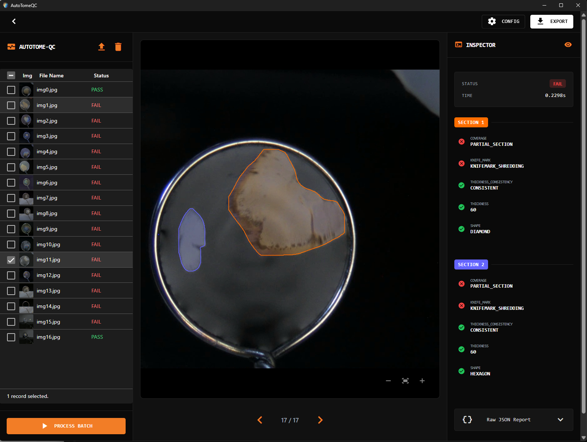

#  AutoTomeQC - Web UI AutoTomeQC

This is the web interface for the AutoTomeQC pipeline. It is built using the [NiceGUI](https://nicegui.io/) framework.



## Features

*   **Upload Queue**: Select multiple images to create a processing queue.
*   **Batch Processing**: Run the AutoTomeQC analysis on all pending images with a single click.
*   **Interactive Viewer**: Click on any image in the queue to view it, along with its detailed QC results and segmentation masks.
*   **Configuration**: View the backend system configuration directly in the UI.
*   **Export**: Download all processed images and their corresponding JSON result files as a single ZIP archive.

## Getting Started

This web application is designed to be run from the root of the `AutoTomeQC` workspace.

### Installation

Ensure you are in the project's root directory and synchronize the environment using `uv`:
```bash
uv sync
```

### Running the Application

The `autotome-ui` command launches both the backend server and the web UI.

```bash
# Launch with default settings from the project root
uv run autotome-ui
```
You can then access the UI in your browser at the address provided in the terminal (e.g., `http://localhost:8080`).

**Optional Arguments:**
*   `--ui-port <port>`: Sets the port for the web interface (default: 8080).
*   `--backend-port <port>`: Sets the port for the backend API (default: 8000).
*   `--log-level <level>`: Sets the logging verbosity (e.g., `DEBUG`, `INFO`, `WARNING`).
*   `--web`: Forces the app to open in a web browser instead of a native window. In this mode, file uploads are limited to 1000 files at a time due to browser and websocket constraints.

**Example:**
    ```bash
    # Run on different ports with debug logging in a web browser
    uv run autotome-ui --backend-port 8001 --ui-port 8081 --log-level DEBUG --web
    ```

## Development

This project uses `uv` for dependency management and a suite of tools for ensuring code quality.

### Running Tests
- Unit Testing
```bash
uv run pytest
```

### Code Quality

We use `ruff` for linting and `mypy` for static type checking, consistent with the `qc` module.

**Linting:**
```bash
uv run ruff check src
```

**Type Checking:**
```bash
uv run mypy src
```